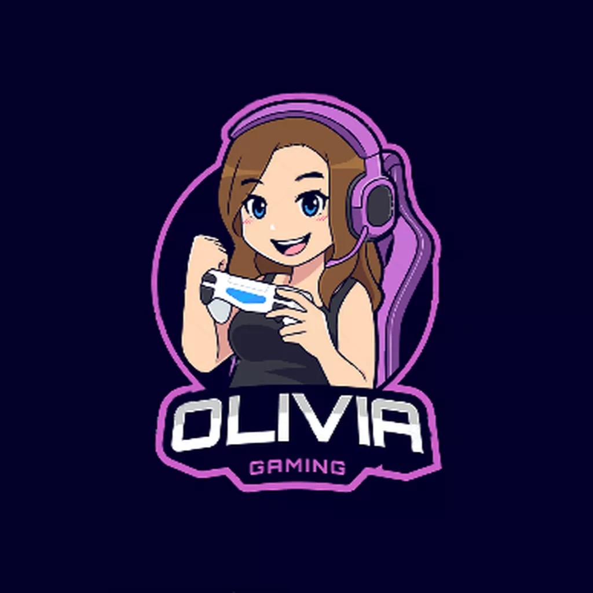

<h1 align="center">
   
  
   
  QueenOlivia Discord Bot
   
</h1>

<h3 align=center>A fully customizable bot built with <a href=https://github.com/discordjs/discord.js>discord.js</a></h3>

  

  

  

  <a href="#about">About</a>
  •
  <a href="#features">Features</a>
  •
  <a href="#installation">Installation</a>
  •
  <a href="#setting-up">Setting Up</a>
  •
  <a href="#license">License</a>
  •
  <a href="#credits">Credits</a>

## About

QueenOlivia is one of source it easy and afforrdable commands beside its has multipurpose bot and you need to invite her to your Discord server using [this](https://discord.com/api/oauth2/authorize?client_id=832937425515970582&permissions=3489660897&scope=bot) link! Also, you can join the official [QueenOlivia Support Server](https://discord.gg/6dtx3z2fnN) for all questions, suggestions, and assistance!

If you liked this repository, feel free to leave a star ⭐ to help promote QueenOlivia!

## Credits

* **Sapphire_Bluez** - *Initial work* - [github](https://github.com/sapcraft-org)
* **Dodogames** - *Project Advisor*- [github](https://github.com/dodogames7)
* **Ruslana* - Ruslana_Novak#9106
 
##features of QueenOlivia
- ✅ music 
- ✅ moderation 
- ✅ NSFW 
- ✅ Info
- ✅ giveway
- ✅ fun
- ✅ help
- ✅ economy 
- ✅ nsfw 
- ✅ utility   
- ✅ search
- ✅ owner 
- ✅ premium. 
 
